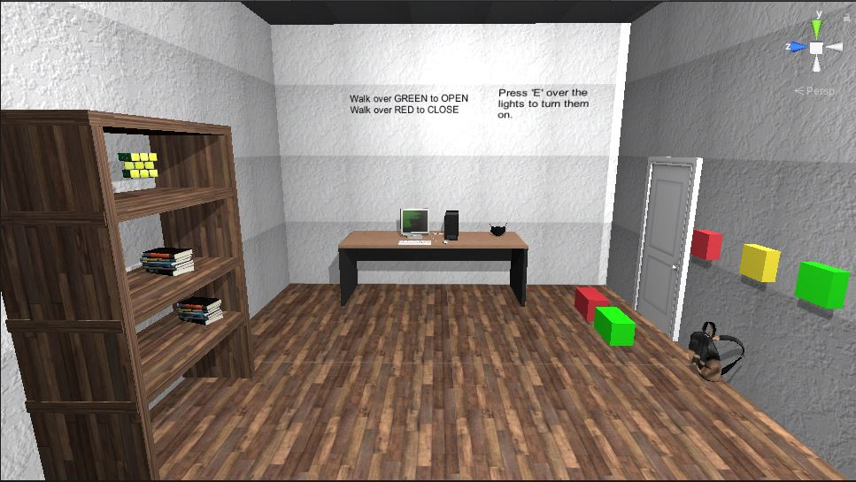
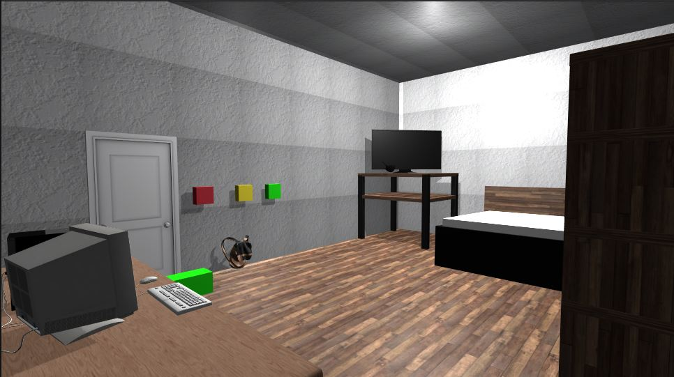
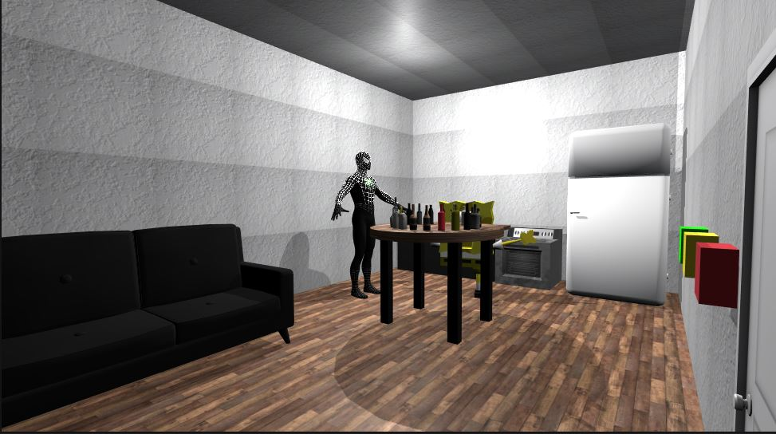
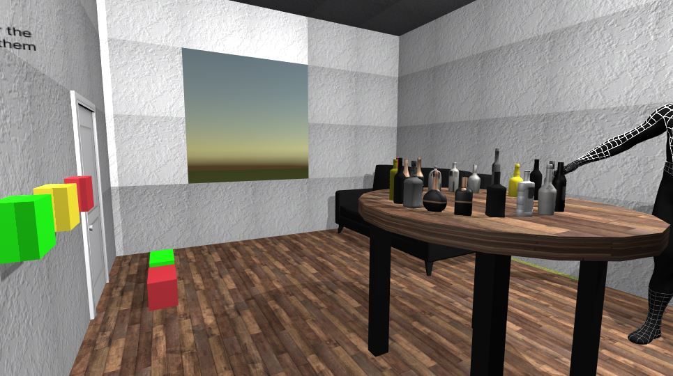

# CS4331 Project 2 Report
Remade my Project 1 that used glitch/aframe to unity, due to unfortunate circumstances.

For this Project I had the task of implementing my Project 1 environment using unity instead of glitch/aframe. 
There are some small changes that I decided to make to the project to make it a little different/smoother. I decided to make the door opening animation different as well as the way that the user interacts with the door. In the first project the user was able to hover over and click on buttons to open and close the door, but in this project I decided it would be simpler/cooler to have the user walk over certain things to cause the door to open and close without the user clicking anything. The user has some smal text in the starting room so they are able to tell how to open and close the door as well as change the color of the lights. Another small thing that I decided to implement is gravity for the user, when the demo is started the user is on top of the bed that I made and they are able to step off to the ground, its small but another thing I wanted to implement in unity. 

Demo Video

Starting Room/Bed Room
At the start the user is able to see the text that lets them know how to operate the lights as well as the door. 

Kitchen/Living Room

Desk:
https://sketchfab.com/3d-models/desk-3d-free-agustin-honnun-0dc0699cf28c4a1684bf0f9ebf58f8bf

FaceMask:
https://sketchfab.com/3d-models/face-protection-dust-musk-7262f97b26b34d55b57a80ff70f34336

Computer:
https://sketchfab.com/3d-models/computer-setup-older-free-82eaf2047e0447a1bfea22482f1d1404

TV:
https://sketchfab.com/3d-models/led-tv-014e75456b4e465b9cecd1b136a0312b

Stove:
https://sketchfab.com/3d-models/stove-11ec73f295a6445d93b6a212aacc021b

Microwave:
https://poly.google.com/view/0YYExMzwX0V

Fridge:
https://sketchfab.com/3d-models/fridge-2e6576fae0ea4034b09cd48722feb9a7

SpiderMan:
https://sketchfab.com/3d-models/spiderman-original-2ed06987d6204854a7fe133684cb66e3

Spongebob:
https://sketchfab.com/3d-models/sponge-bob-54381dae288f44c1a0ab80dffae3389f

Door:
https://sketchfab.com/3d-models/door-d23ec435af454cf985292778dbd65c9e

Couch:
https://sketchfab.com/3d-models/leather-and-fabric-sofa-c715fad78e6c4fc79b3b54d40ab50d07

BackPack:
https://sketchfab.com/3d-models/backpack-e09c9e13385342a98c1d12f4ffc21bff

Rubiks Cube:
https://sketchfab.com/3d-models/rubiks-cube-3x3-by-3d-mas-free-assets-fe18cb3d8a974906b77e1ab5bd17b41a
  
Books:
https://sketchfab.com/3d-models/book-collection-n1-free-download-59dab6c9e08148f1b5a69a9a208c5ea3

Bottles:
https://sketchfab.com/3d-models/20-liquor-bottles-4729b1cfa5b74db68924190242f8ac76
